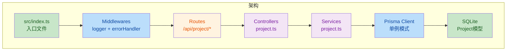

## 项目结构

```text
├── src/
│   ├── config/             # 环境变量与全局配置
│   ├── controllers/        # 控制层：处理 HTTP 请求，解析参数，返回响应
│   ├── services/           # 业务逻辑层：核心业务、调用 Prisma 操作数据库
│   ├── routes/             # 路由定义：将 URL 映射到对应的控制器
│   ├── middlewares/        # 中间件：身份验证、错误处理、日志记录
│   ├── schemas/            # 数据校验规则定义
│   ├── types/              # 自定义类型声明 (*.d.ts)
│   ├── utils/              # 工具函数
│   ├── client.ts           # Prisma 实例单例封装
│   └── index.ts            # 入口文件：启动服务器
├── prisma/
│   ├── schema.prisma       # 数据库模型定义
│   └── dev.db              # SQLite 数据库文件
├── .env                    # 环境变量
├── tsconfig.json           # TS 配置
└── package.json
```

## 架构与流程图



## zod

利用 Zod 定义 Schema，并使用 z.infer 自动生成类型，确保校验逻辑与代码类型完全同步

1. Schema 既负责运行时的必填项校验，也负责开发时的类型提醒
2. 解耦：Controller 只关注业务，校验交给中间件，错误交给全局 Error Handler
3. 安全性：SQLite/Prisma 层通过 Schema 保证了入库数据的纯净
